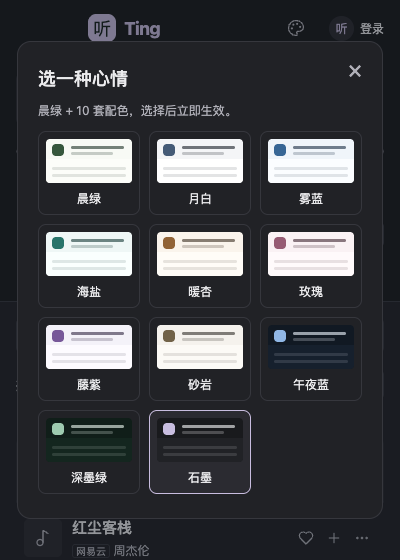

# 听 · Ting

一个小窗口里的网易云音乐 / QQ 音乐第三方桌面播放器。使用 Tauri v2、TypeScript 和 Rust，支持双账号、混合来源的本机歌单、同步歌词与本地音频播放。

**当前源码版本：0.9.3；本次发布 Windows x64 修复版。** Windows 版已实测启动、播放和下载，默认保存到系统下载目录的 `Ting` 文件夹。macOS 交付目标仍为 macOS 15 及以上、Apple Silicon；本次未重新构建 macOS / Linux 安装包。QQ 接口与下载已迁移到 Rust，应用不再携带 Python。iOS 16+ 开发签名真机版处于功能验收阶段，Android 尚未完成发行适配。迁移范围与真机构建方法见 [Rust 迁移与 iOS](docs/RUST-MIGRATION.md)。


*截图来自自动化测试，使用模拟歌曲和静音音频，不包含私人账号信息。*

## 功能

- 网易云支持手机号验证码与扫码登录，手机默认验证码；QQ 音乐支持手机 QQ / 微信扫码，两平台可以同时登录。
- 按平台搜索歌曲，读取创建和收藏的歌单；歌曲和歌单均标明来源。
- 歌单按「最近 / 网易云 / QQ音乐 / 本机」分组；成功播放歌单后记录最近使用时间。
- 手机 / 平板轻点歌曲播放；桌面单击选中，双击或回车播放；顺序、随机、单曲循环三种模式。
- 播放歌单时后台分页补齐队列，不再把队列限制在 100 首；保存在线歌曲队列元数据。
- 本机收藏与混合歌单：可以把两平台的歌曲放进同一个本机歌单。
- 歌曲增删、顺序调整、跨平台版本选择，支持范围见下表。
- 统一「标准 / 高品质 / 无损 / 最高可用」音质选项，展示实际返回档位。
- 桌面歌词在窗口整体右侧展开，手机使用全屏面板，当前行平滑居中；支持手动浏览、回到当前行和点击歌词定位。
- 下载当前在线歌曲的最高可用完整音源，保留原格式，写入标签、封面及歌词。
- 导入本地音频并离线播放；11 套主题配色；macOS 标题栏与内容区融合。

### 歌单操作范围

| 操作 | 网易云自己的歌单 | QQ 自己的歌单 | 本机混合歌单 |
| --- | --- | --- | --- |
| 加入 / 移除歌曲 | 同步到平台 | 同步到平台 | 保存到本机 |
| 上移 / 下移 / 置顶 / 置底 | 同步到平台 | **仅保存本机顺序** | 保存到本机 |
| 创建 / 重命名 / 删除歌单 | 暂不提供 | 暂不提供 | 支持 |
| 混合两平台歌曲 | 需选择网易云对应版本 | 需选择 QQ 对应版本 | 直接支持 |

收藏的他人歌单只读。跨平台加入会先搜索目标平台，由用户核对歌名、歌手、专辑和时长，再确认加入；不会把 QQ 歌曲 ID 直接当作网易云 ID。

歌曲行的「…」打开歌单操作。移除歌单歌曲不会同步修改已经生成的播放队列。本机收藏不是平台的“我喜欢”，也不会修改账号的喜欢列表。

## 安装与运行

### 使用已有 macOS 应用包

应用包面向 **macOS 15 及以上的 Apple Silicon Mac**。解压后，将 `听 · Ting.app` 放到「应用程序」并打开。

发布包使用原生 Rust 网络、音频校验和标签模块，不需要 Homebrew、Python 或 FFmpeg，也不会启动 Python 子进程。

当前开发构建未做 Developer ID 签名和公证。请只运行可信来源的构建。仓库没有自动更新器；源码更新后需重新构建并替换应用。根目录的 `打开 Ting.command` 优先打开当前版本 `Release/v<version>/macOS-AppleSilicon/` 中的应用，其次打开构建输出，**它不会自动重新编译**。

### 从源码开发

在上述 macOS / 芯片环境准备 Node.js 22、npm、Rust stable 和 Xcode Command Line Tools。应用构建无需 Python；可选发布和凭据扫描脚本使用开发机的 `python3`。在项目目录执行：

```sh
npm ci
npm run prepare:desktop
npm run tauri dev
```

首次构建需要联网下载 npm 与 Cargo 锁定的依赖。`prepare:desktop` 预取 Rust 依赖；构建前自动记录源码和许可文件指纹。

只预览网页界面：

```sh
npm run dev
```

浏览器预览不提供 Rust IPC，因此不能进行真实云端搜索、登录、下载。自动化测试使用的模拟接口只存在于测试中，不会打进生产页面。

项目脚本优先使用本机可选的 `work/toolchain/` Rust 环境；普通源码使用系统 Rust，仓库不携带私人工具链。

### 构建 macOS 应用

```sh
npm run tauri -- build -- --locked
```

默认产物：

```text
src-tauri/target/release/bundle/macos/听 · Ting.app
```

构建前自动检查版本号与源码候选文件，并记录源码和内置资源指纹。构建不会自动覆盖 `/Applications` 或根目录的旧 `.app`。运行产物前请核对路径，避免打开旧版本。

生成可核对来源的交付包时，先完成回归、审查并提交代码，再从干净提交构建：

```sh
npm run check:release
npm run tauri -- build -- --locked
python3 -B scripts/release.py --gitleaks /path/to/gitleaks
```

发布脚本验证应用与当前提交、源码指纹和资源 SHA256 一致，扫描源码、Git 历史与暂存应用中的凭据，拒绝残留 Python 资源并逐层签名。输出到 `Release/v<version>/`（应用位于 `macOS-AppleSilicon/`，源码包位于 `Source/`），包含源码 ZIP、应用 ZIP、校验和及 Git commit；拒绝覆盖已有输出。脚本不会自动安装或上传。详细流程见 [构建和发布脚本](scripts/README.md)。

### Linux / Windows

Tauri 支持这些平台，本项目当前只配置并检查 macOS `app` 产物。Rust 迁移已消除 Python 运行时和 native wheels 的移植障碍。其他平台仍需实现凭据持久化、适配打包与系统 WebView 音频能力。iOS 首版提供手机布局、钥匙串和沙盒下载；原生后台播放、锁屏控制与同机扫码替代流程仍需后续实现。

## 使用说明

### 登录和账号

点击右上角账号按钮。手机默认使用网易云手机号验证码登录，验证码发送间隔至少 60 秒，会话 10 分钟有效；也可切换到扫码。手机号与验证码仅在当前登录流程中使用，不写入本地存储。平台要求额外安全验证时，可在官方 App 处理或切换扫码。

iOS 的扫码页提供「保存或分享二维码」系统面板，分享经过校验的原像素 PNG 文件。可尝试在对应 App 的扫一扫中从相册选图；不同平台登录码未必支持图片识别，拒绝时仍需另一设备显示扫码。当前没有 QQ / 微信官方 App 一键授权跳转，不能将分享成功视为登录成功。两个平台分别保存登录状态，可独立退出。macOS / iOS 凭据由 Rust 保存到系统钥匙串，不保存密码，也不把凭据写入前端 localStorage。

二维码保留黑白码点和静区；QQ 返回的大图按确定性方式适配，显示前会对原图和适配后的图实际解码、核对内容。二维码解码校验不等同于手机端授权成功，仍需用户扫码确认。

启动账号恢复与扫码流程分别处理，取消扫码不会丢弃已有会话的恢复结果。账号验证或二维码获取失败可重试；两个平台的退出操作相互独立。

### 播放、队列与音质

桌面单击歌曲只选中，双击或回车播放；iOS / Android 轻点歌曲播放，重复轻点不会重启正在播放或加载的歌曲。点击歌曲右侧加号只加入队列，点击「播放全部」开始播放当前列表。队列数字后的省略号表示仍在后台加载。切换浏览页面不打断队列加载；改播其他列表或手动编辑队列会取消旧的补齐任务。

| 选项 | 网易云请求 | QQ 请求 |
| --- | --- | --- |
| 标准 | 标准档 | MP3 128 kbps |
| 高品质 | 高品质档 | MP3 320 kbps，必要时降级 |
| 无损 | 无损档 | FLAC，必要时降级 |
| 最高可用 | 母带、Hi-Res、无损等候选 | 臻品母带、FLAC、320、128 候选 |

播放区展示接口实际返回的音质和格式。音源由账号会员权限、歌曲版权及平台接口决定；选择最高档不保证每首歌都有该档位。切换音质会重新取流，并尝试保留进度和暂停状态。试听片段会明确标注。

随机模式使用打乱后的候选队列，上一首参考仍在队列中的有效播放历史。移除歌曲会同步清理历史，上一首不会把已移除歌曲重新加入；移除当前歌曲不会立即打断播放，曲末按剩余队列继续。空队列会停止续播。

### 歌词与主题

点击播放控制旁的「词」，窗口向右扩展显示歌词；关闭歌词后收回增加的宽度。滚轮或触摸浏览歌词会暂停自动跟随，点击「回到当前歌词」恢复。点击一句歌词可跳到对应时间，暂停状态下不会自动开始播放。

右上角调色盘可选择：晨绿、月白、雾蓝、海盐、暖杏、玫瑰、藤紫、砂岩、午夜蓝、深墨绿、石墨。主题选择会保存在本机，切换不会重新加载音频。



### 下载

播放区的下载按钮下载当前在线歌曲，保存到系统下载目录下的 `Ting/`：

```text
歌名 - 歌手 [歌曲ID].flac
歌名 - 歌手 [QQ-歌曲ID].flac
同名文件.lrc
同名文件.json
```

实际音源为 MP3 时保留 `.mp3`，不转码成伪无损。文件写入歌曲、歌手、专辑、年份、封面和歌词；缺失封面或歌词会提示。当前只嵌入平台返回的有效 JPEG 封面，其他图片格式会提示封面不可用，不影响合格音频的保存。同名文件自动加序号，保留已有音频和侧边文件。

下载检查返回字节数、可用的 MD5、音频格式和时长，再用 Rust Symphonia 分块解码整个音频并核对解码帧数；试听、截断或无法完整解码的文件不会作为成功结果保存。单曲上限 512 MiB，网络与解码均有超时；临时文件由后端管理和清理。音源、封面使用独立无账号 Cookie 的 HTTPS 客户端，仅访问已知平台 CDN。

音频标签和来源 JSON 分别记录原歌曲平台 / ID 与实际音源平台 / ID；网易云歌曲使用 QQ 补源时，两套标识都保留。来源 JSON 不包含登录凭据或签名音源 URL。

iOS 下载保存在应用 Documents/Ting，可在「文件 → 浏览 → 我的 iPhone / iPad → 听 · Ting → Ting」查看。移动端歌词在全屏面板显示，音量使用设备按键，搜索提交后收起键盘；触控按钮保留至少 44px 点击区域。Android 暂无安全凭据持久化，登录仅保留本次运行。Windows / Linux 使用系统凭据存储（Windows 凭据管理器 / Linux secret service）保存登录；macOS / iOS 使用钥匙串。

下载不受播放音质选项限制，也不打断当前播放；一次只执行一个下载任务，目前没有取消按钮、批量下载或断点续传。

下载只使用 **Ting 当前登录会话**。网易云没有完整音源时，可使用当前 QQ 账号补源；QQ 未登录会明确提示登录。已删除旧音乐库和 musicfox 凭据文件的隐式读取。

自动补源要求规范化歌名、完整歌手集合、专辑一致，且时长差不超过 2 秒；只有一个候选通过时才继续，并再次读取 QQ 歌曲详情核对版本。现场、伴奏、混音等版本或候选歧义会被拒绝，避免静默下载错歌。这个规则可能拒绝两平台专辑命名不同的同一录音。下载质量仍受当前账号权限和平台音源可用性限制。

### 本地音乐与离线能力

在「本地」页导入音频文件即可离线播放，不会上传本地文件。格式支持取决于系统 WebView；不同操作系统的解码能力可能不同。当前文件访问只保持本次会话，关闭应用后需重新导入。

在线歌曲的收藏、队列、本机歌单只是元数据，不是离线音频缓存。搜索、扫码、云端播放、在线封面和歌词需要联网。已下载文件可通过「本地」页导入。

手机采用上方歌曲内容、底部紧凑播放区与导航；横屏分为列表和播放器两栏。聚焦搜索时临时收起播放器以容纳软键盘；iOS 键盘弹出时按实际可见区域调整登录弹窗，输入框可在弹窗内滚动。各列表保留自己的滚动位置，新打开的歌单从顶部开始；点击「刷新」主动更新云歌单。Logo 在当前首页再次点击不会重载内容。

### iCloud 歌单同步

Mac 和 iPhone 顶栏的云朵按钮可选择同一个 iCloud Drive / Ting 文件夹，自动合并 Ting 收藏、本机混合歌单、歌曲增删和顺序。原有歌单保留，离线修改先保存本机，联网后由系统传输；不上传音乐平台登录凭据或音频文件。首次需在每台设备各授权一次目录，详情见 [iCloud 同步说明](docs/ICLOUD-SYNC.md)。

### 平台交互与快捷键

| 操作 | 快捷键 / 交互 |
| --- | --- |
| 聚焦搜索 | `⌘ K` / `Ctrl K` |
| 播放 / 暂停 | 非输入控件焦点下按空格 |
| 播放焦点歌曲 | 回车 |
| 桌面选择 / 播放歌曲 | 单击 / 双击 |
| 手机 / 平板播放歌曲 | 轻点；收藏、加队列和更多按钮独立响应 |
| 系统媒体控制 | 支持时使用系统播放、暂停、上一首、下一首 |

## 架构与目录

```text
WebView 页面（TypeScript / CSS）
  ├─ HTMLAudioElement：在线音源 / 本地文件播放
  └─ Tauri IPC → Rust
       ├─ 网易云 WEAPI、钥匙串、原生窗口操作
       ├─ QQ Rust 协议接口 → 登录、搜索、歌单与会员音源
       └─ Rust 下载 → Symphonia 全流校验、Lofty 标签与原子保存
```

生产应用加载打包的前端静态资源，不启动本地 HTTP API 服务。Vite 仅用于开发。QQ 与下载请求直接在 Rust 中执行，复用 HTTP 连接；凭据只在后端内存和系统钥匙串中保存。

```text
ting-music/
├── src/
│   ├── main.ts               # 页面、播放与账号协调
│   ├── playback-queue.mjs     # 队列、有效播放历史与移除游标
│   ├── settings.ts           # 容错的本机偏好读写
│   ├── library.ts            # 歌单操作、跨平台匹配、最近播放
│   ├── lyrics.ts             # 右侧歌词、跟随与动画
│   ├── themes.ts             # 主题配色
│   ├── qr.ts                 # 二维码生成、适配和解码校验
│   ├── model.mjs             # 歌曲标识、歌词解析、随机队列
│   └── style.css
├── src-tauri/src/            # Rust IPC、双平台协议、下载与音频校验
├── src-tauri/tauri.ios.conf.json # iOS 配置
├── resources/licenses/      # 随应用交付的第三方许可
├── resources/build/         # 构建时生成的来源指纹
├── scripts/                 # 构建、iOS 工程准备、凭据扫描及发布验证
├── .github/workflows/ci.yml  # 回归、原生构建、漏洞与历史凭据扫描
├── tests/                   # 前端与手机布局回归
├── docs/                    # 截图、验证历史与审查结果
├── THIRD_PARTY_NOTICES.md
└── 打开 Ting.command
```

`node_modules/`、`dist/`、`work/`、Rust `target/`、`.app`、测试输出及本地凭据同样排除在 Git 之外。

现有应用标识仍是 `com.ting.music.demo`，用于兼容既有钥匙串和应用数据。修改它会影响已有用户数据的读取，不能只为去掉 demo 字样直接更换。

## 开发验证

准备好资源后运行以下检查。FFmpeg 仅用于开发测试生成合成音频，应用运行和下载均不依赖它。

```sh
# 仅开发测试需要
brew install ffmpeg
npx playwright install chromium

# 格式、构建与回归
npm run format:check
npm run build
npm test
npx playwright test
node scripts/cargo.mjs fmt --manifest-path src-tauri/Cargo.toml -- --check
node scripts/cargo.mjs test --locked --manifest-path src-tauri/Cargo.toml
python3 -B scripts/infrastructure-test.py
npm run check:release
```

修改前端后可执行 `npm run format` 统一格式。Playwright 自动启动 Vite；macOS 安装了 Google Chrome 时优先使用该浏览器，也可设置 `PLAYWRIGHT_CHROMIUM_EXECUTABLE`。公开二维码 fixture 为合成测试数据。

0.9.0 的重写回归覆盖网络鉴权、会员音质、歌单权限、下载校验、来源标签和无覆盖保存；原有浏览器回归继续保留，并增加 iPhone 布局与 Mac 顶栏检查。具体执行结果和实测边界见 [迁移记录](docs/RUST-MIGRATION.md)。

CI 执行格式、前端 / 浏览器 / Rust / 发布脚本回归、macOS 构建及源码和历史凭据扫描。联网测试默认忽略，须显式运行；真实云端歌单写入和新账号扫码完成不能用离线测试结果代替。

## 常见问题

**为什么 QQ 已登录却没有高音质？**

先确认登录的是持有会员的账号，再查看播放区的实际返回档位。Rust 适配器在 WEB / DESKTOP 请求中携带会员认证参数，并保留音源 MID、歌曲类型和规范 GUID。具体歌曲仍受账号权限、版权和平台接口影响。

**为什么换了源码，界面还是旧的？**

运行的可能是 `/Applications`、根目录或预览目录中的旧应用。`npm run tauri build` 只更新构建输出，已经运行的进程也不会自动换成新代码。

**为什么最近播放里没有历史歌单？**

记录从支持此功能的版本开始积累；只浏览歌单不记入最近播放，成功开始播放后才记录。

**QQ 排序为什么手机端不变？**

目前 QQ 排序仅保存在此设备，并按账号隔离。加入、移除歌曲才同步到 QQ 平台。

**能否把 QQ 歌直接加进网易云？**

可以通过目标平台版本匹配加入；目标平台没有对应版本时，保留在本机混合歌单中。混合歌单不迁移音频文件或平台版权。

**账号和本机歌单能否同步到另一台电脑？**

没有自动同步或导入导出功能。平台自己的歌单随平台账号，本机歌单、收藏、主题、队列等依赖本机 WebView 存储。卸载前应自行备份所需数据。

## 已知限制与贡献

0.8.0 的审查修复继续保留，0.9.0 将 QQ 与下载迁到 Rust 并增加 iOS 真机构建。完整范围和验证边界见 [审查记录](docs/REVIEW.md) 与 [验证历史](docs/VALIDATION.md)。当前仍未完成跨平台发行、自动更新、Developer ID 公证、跨平台凭据持久化和本机数据迁移工具。

提交问题时请提供系统、应用版本、启动路径、歌曲所属平台、期望行为和复现步骤；请勿附带 cookie、登录二维码、会员凭据或带签名的音源地址。修改平台接口时，请增加脱敏测试，并注明哪些路径经过真实验证、哪些仅使用模拟响应。

项目自身尚未指定统一开源许可证。第三方组件及协议参考说明见 [THIRD_PARTY_NOTICES.md](THIRD_PARTY_NOTICES.md)。历史验证记录见 [docs/VALIDATION.md](docs/VALIDATION.md)。
